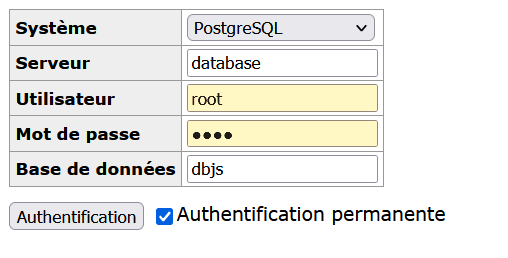

# myTinyNestJS
This is a project made by 4 MTI EPITA students.
Their logins are:
- antoine.du-fou
- antony.yang
- erwan.salle
- louis.santucci

The database is PostgreSQL.

The used ORM is Prisma

The used framework for the REST API is NestJS.

## How to use
You can use ``docker compose build`` to build, and ```docker compose up``` to run the solution.

The project runs on the port 3000 for the app container, and uses the port 5432 for PostgreSQL database container.

An adminer part is available on port 8090 to better access on the database.

To have access to the Adminer part, you need to use the following credentials:
- System: PostgreSQL
- Server: database
- User: root
- Password: root
- Database: dbjs



When running, the app seeds itself with a few users, NFTs and their collections, and some teams.

The Admin account have the following credentials:
- email: ``admin@gmail.com``
- password: ``password``

The other users' credentials are directly available on adminer.

All the different requests can be made on Postman, and all the different endpoints of the API server are available in a Swagger with the following link: http://localhost:3000/docs

## Test Suite

We have a e2e test suite done with Jest.

The test suite can be run with ``yarn test``
